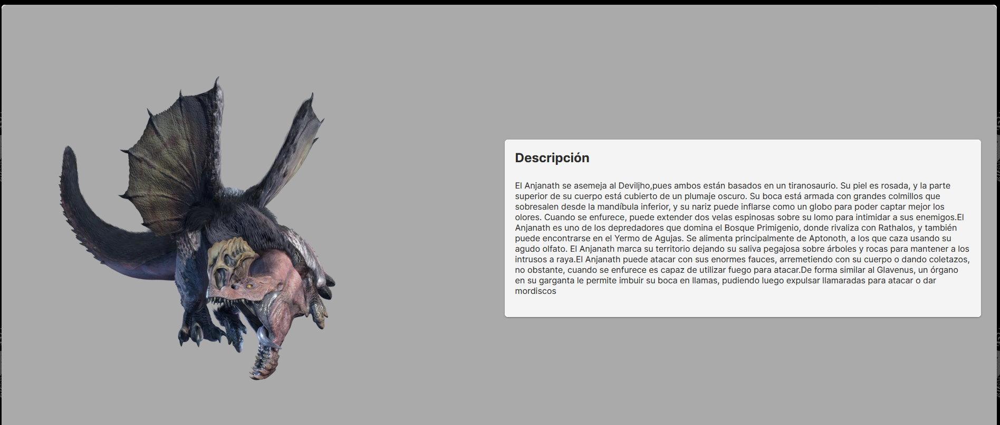
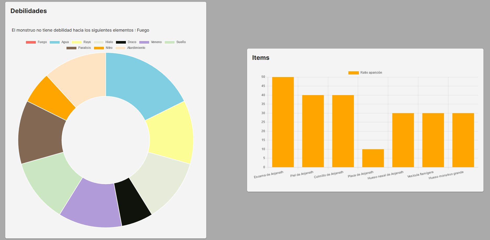

# Monster Hunter World - Wiki

Mhw - wiki es una wiki local del juego Monster Hunter World. Esta guía nos permite ver las estadisticas de los monstruos ( resistencias a los elementos ) y un listado de los items de los monstruos introducidos asi como su probabilidad de obtenerlos

Los items salen listados y pueden ser filtrado por el nombre del monstruo

Una vez seleccionado a el monstruo que queremos ver nos saldrá por pantalla : 
1. Una imagen del monstruo
2. Una descripción detallada del mismo

	
3. Gráfia con las estadísticas del monstruo ( resistencias a los elementos )
4. Gráfica con los ratios de drops de los items del monstruo

> **Importante:** La guía solo contempla **algunos de los monstruos** del videojuego.

Tabla explicativa de los campos de los modelos :

|            |Monstruos                            |Items                                |
|------------|-------------------------------------|-------------------------------------|
|ID				   |Numero identificativo único `Number` |Numero identificativo único `Number` |
|Nombre      |Nombre del monstruo `String`         |Nombre del item `String`             |
|Imagen      |Ruta de la imagen `String`           |Ruta de la imagen `String`           |
|Descripción |Descripción del monstruo `String`    |- - - - - - - - - X - - - - - - - - -|
|Icono       |Ruta de la imagen (icono) `String`   |- - - - - - - - - X - - - - - - - - -|
|Stats       |Array de estadisticas `Array Int`    |- - - - - - - - - X - - - - - - - - -|
|ID Monstruo |- - - - - - - - - X - - - - - - - - -|Identificador del monstruo al que pertenece `Number`|
|Ratio       |- - - - - - - - - X - - - - - - - - -|Porcentaje de aparicion del item `Number`|

Esquema con el funcionamiento de la páguina :

## Instalación de la página

1. Clone el repositorio en una carpeta
2. Entre en la ruta de la carpeta
3. Inicie el comando `npm install`
4. Escriba el comando `npm start`
5. Ejecute el comando `ng serve --open` para abrir el servidor local de la aplicación
